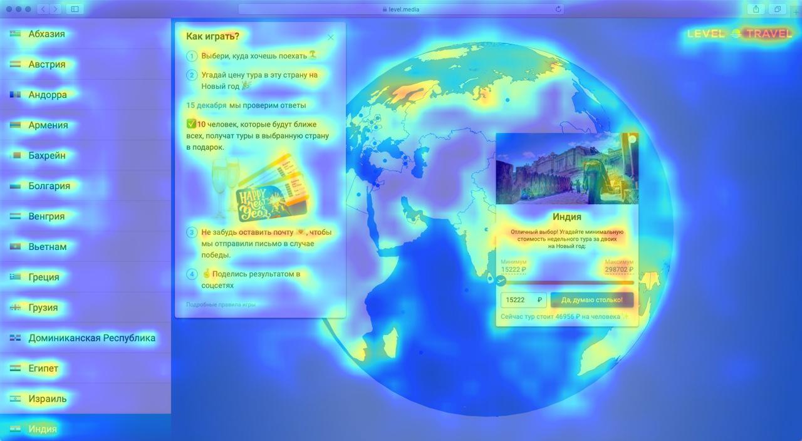
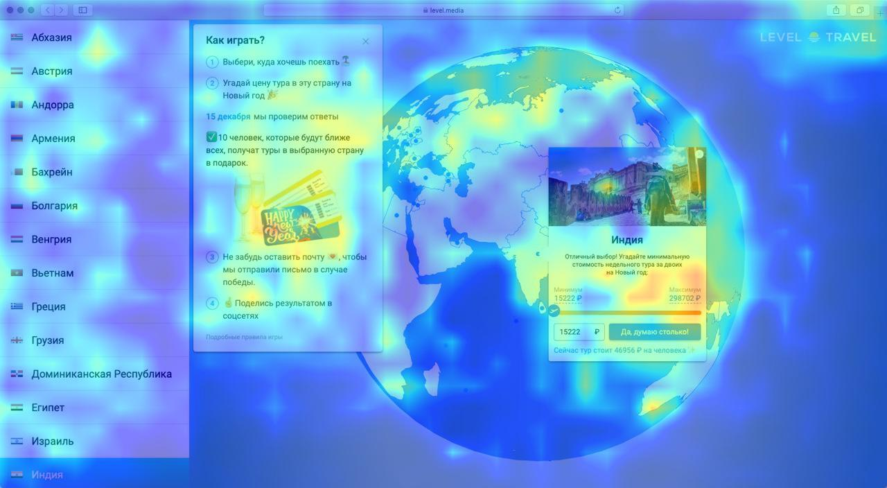
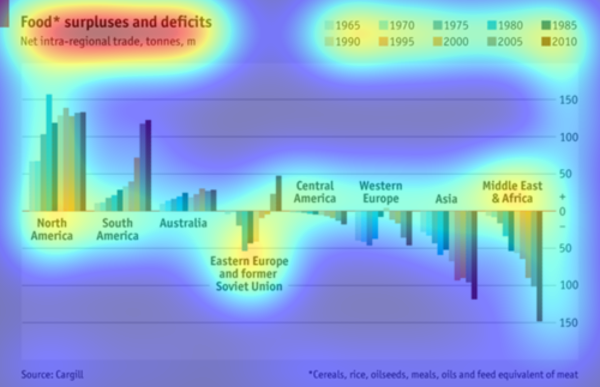
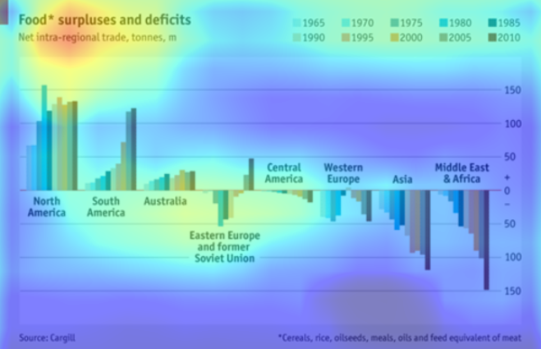

# Beginner's friendly of PyTorch Implementation for 'Learning Visual Importance for Graphic Designs and Data Visualizations'

### Abstract

Knowing where people look and click on visual designs can provide clues about how the designs are perceived, and where the most important or relevant content lies. The most important content of a visual design can be used for effective summarization or to facilitate retrieval from a database. We present automated models that predict the relative importance of different elements in data visualizations and graphic designs. Our models are neural networks trained on human clicks and importance annotations on hundreds of designs. We collected a new dataset of crowdsourced importance, and analyzed the predictions of our models with respect to ground truth importance and human eye movements. We demonstrate how such predictions of importance can be used for automatic design retargeting and thumbnailing. User studies with hundreds of MTurk participants validate that, with limited post-processing, our importance-driven applications are on par with, or outperform, current state-of-the-art methods, including natural image saliency. We also provide a demonstration of how our importance predictions can be built into interactive design tools to offer immediate feedback during the design process. [Article link](https://arxiv.org/abs/1708.02660) 

### Easy way to try

1. [Download](https://drive.google.com/file/d/1U77h0kMICBuVTfxGdb_8LSPVPBeajYKy/view?usp=sharing) pretrained models and put in: `~/pretrained_models`  
(all models in one zip file, ~2Gb: `gdi_fcn32.pth`, `gdi_fcn16.pth`, `massvis_fcn32.pth`, `voc_fcn32.pth`)  
2. Check libraries: `~/requirements.txt`
3. Paste PNG/JPG file (only RGB) in: `~/examples/in`
4. Check `img_name` in `~/test.py` 
5. Run: `~/test.py` 
6. Get the result in: `~/examples/out`

If you take the png with the alpha channel (RGBA), then an error will occur.  
**Solution:** convert PNG to JPG or make a flatten PNG.  

The best result gives `gdi_fcn16`

### Examples: 

*Result from* `fcn16s`



*Result from* `fcn32s`



### What's next?

- need a python conversion module for png RGBA to RGB flatten
- help to add Python code to modify the asset bitmap files and not one by one.
- help writing a python module in order to use GPU (nvidia) resources and not CPU
- tool and algorithm for markup of graphic design samples, GUI and data visualisation for train FCN
- way to train FCN in two datasets of good and bad visual design.
- way to compare the usability test results and the visual importance prediction results to ensure the quality of the prediction and understand the discrepancies with reality
- big goal is to teach a neural network to predict good and bad design by making it a plug-in for prototyping tools such as a figma or sketch  

Thanks a lot to for my mentor **Lena Sukmanova** for helping to launch the algorithm.

### References

1. Machine Learning for Everyone. [Link](https://vas3k.com/blog/machine_learning/)

2. Learning Visual Importance for Graphic Designs and Data Visualizations. [Link](http://web.mit.edu/zoya/www/docs/predImportance_final.pdf)

3. Learning Layouts for Single-Page Graphic Designs. [Link](http://www.dgp.toronto.edu/~donovan/layout/index.html)

4. Predicting Attention for Design Feedback [Link](https://visxvision.files.wordpress.com/2017/11/3mininfovis.pdf)

5. 19 Things We Can Learn From Numerous Heatmap Tests [Link](https://conversionxl.com/blog/19-things-we-can-learn-from-numerous-heatmap-tests/)

6. What are Web Heatmaps, Really? (And the 4 Major Problems of Heat Mapping Tools) [Link](https://blog.fullstory.com/what-are-web-heatmaps-how-do-they-work-pros-cons-alternatives/)

7. What We Can Learn From Heat Map Studies to Improve Our Calls-to-Action [Link](https://moz.com/ugc/what-we-can-learn-from-heat-map-studies-to-improve-our-callstoactions)  


На русском:

1. Машинное обучение для людей [Link](https://vas3k.ru/blog/machine_learning/?fbclid=IwAR13ujEKXaXaxlkeiBucDGfLDHILl21LqJHt6b4D6Otlte9Eu59a9RAJ6YE)

2. Карта внимания пользователей для дизайнеров (разные точки зрения в комментариях) [Link](https://vc.ru/flood/29427-neyronnaya-set-dnya-karta-vnimaniya-polzovateley-dlya-dizaynerov)

3. 19 уроков на основании анализа тепловых карт и айтрекинга [Link](https://lpgenerator.ru/blog/2014/06/19/shkola-internet-marketinga-19-urokov-na-osnovanii-analiza-teplovyh-kart-i-ajtrekinga/)

4. Тепловые карты в контексте веб-дизайна [Link](https://lpgenerator.ru/blog/2017/04/06/teplovye-karty-v-kontekste-veb-dizajna/)

5. Как улучшить Calls-to-Action с помощью тепловых карт [Link](https://lpgenerator.ru/blog/2017/05/23/kak-uluchshit-calls-action-s-pomoshyu-teplovyh-kart/)  


[Original source.](https://github.com/cydonia999/visimportance-in-pytorch) Below README from original source:

---

## PyTorch Implementation for 'Learning Visual Importance for Graphic Designs and Data Visualizations'

This repo implements training and testing models for [1] by PyTorch, and based on 
 [Caffe codes](https://github.com/cvzoya/visimportance) authors of [1] provide.

### Dataset

To download datasets, GDI (Graphic Design Importance) Dataset and Massvis (Visualization) Dataset,
see [authors' repo](https://github.com/cvzoya/visimportance/tree/master/data).

### Testing

Usage: 
```bash
python visimportance.py  --dataset <dataset_name>            # name of dataset, gdi or massvis (default: gdi)
                         --dataset_dir <directory_path>      # dataset directory
                         --fcn_type <fcn_type>               # FCN type, fcn32 or fcn16 (default: gdi)
                         --overlaid_img_dir <directory_path> # output directory path for images with heatpmap overlaid onto input images
                         --pretrained_model <file_path>      # pretrained model converted from Caffe models
                         --gpu <device_id>                   # GPU id (default: 0)
                         --eval_only                         # evaluation only
```
    
#### Pretrained models

The followings are PyTorch pretrained models. Specify the file path to `--pretrained_model` option.

* `gdi_fcn32.pth` FCN-32s model for GDI (Graphic Design Importance) Dataset, [link](https://drive.google.com/open?id=1jxsq5W_040Vvr5F-HHvCuqHpJbn3dYbI)
* `gdi_fcn16.pth` FCN-16s model for GDI (Graphic Design Importance) Dataset, [link](https://drive.google.com/open?id=1gRLrwKTacehb3s0n59DcPaV2VGmuWOqZ)
* `massvis_fcn32.pth` FCN-32s model for Massvis (Visualization) Dataset, [link](https://drive.google.com/open?id=17jquhHcE-UcIc3kUaxfKEiSjoBHgneWx)

These models are converted from [Caffe models](https://github.com/cvzoya/visimportance/tree/master/models) authors of [1] provide.

### training

Usage: 
```bash
python visimportance.py  --dataset <dataset_name>            # name of dataset, gdi or massvis (default: gdi)
                         --dataset_dir <directory_path>      # dataset directory
                         --fcn_type <fcn_type>               # FCN type, fcn32 or fcn16 (default: gdi)
                         --overlaid_img_dir <directory_path> # output directory path for images with heatpmap overlaid onto input images
                         --pretrained_model <file_path>      # pretrained model converted from Caffe models
                         --gpu <device_id>                   # GPU id (default: 0)
                         --resume <file_path>                # checkpoint file to be loaded when retraining models
                         --checkpoint_dir <directory_path>   # checkpoint file to be saved in each epoch
                         --config <configuration_id>         # configuration for training where several hyperparameters are defined
```

#### Pretrained models

The followings are PyTorch VOC FCN-32s pretrained model.
Specify the file path to `--pretrained_model` option when you newly start to train models for GDI/Massvis datasets.

* `voc_fcn32.pth` FCN-32s model for GDI (Graphic Design Importance) Dataset, [link](https://drive.google.com/open?id=1o26qejatsnxTBV0Uv_qV89q79rFJYrsE)

This model is converted from [Caffe models](https://github.com/cvzoya/visimportance/tree/master/models) authors of [1] provide.

## Examples

### GDI

* Ground truth


* Predicted by FCN-16s


### Massvis

* Ground truth



* Predicted by FCN-32s



## References

1. Zoya Bylinskii and Nam Wook Kim and Peter O'Donovan and Sami Alsheikh and Spandan Madan
   and Hanspeter Pfister and Fredo Durand and Bryan Russell and Aaron Hertzmann,
   Learning Visual Importance for Graphic Designs and Data Visualizations,
    Proceedings of the 30th Annual ACM Symposium on User Interface Software \& Technology, 2017.
     [authors' site](http://visimportance.csail.mit.edu/), [arXiv](https://arxiv.org/abs/1708.02660)
